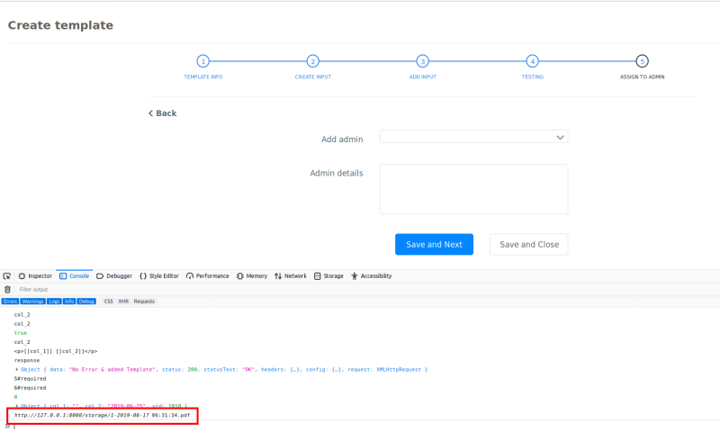

Dynamic Form Building WebApp
=====

This app provides a drag and drop interface to build forms.  
This form can then be used to populate valus in a template that the forma creator can create.  
A sample pdf of the filled form is generated and showed in the end. This can be accessed from the link that can be seen in the console. 

# INSTALL (UBUNTU)
1. Set up a new mysql user.
2. Setup a new database for the mysql user.
3. Runs the following commands
    ```bash
    sudo chmod a+x run.sh
    ./run.sh
    ```
4. Copy the 'localhost....' and open it in your browser.
5. Go to "Rental Agreements" > "Templates" > "Create Template"

# Usage
1. Provide a form title.
2. Specify the form fields by dragging from the right.
3. <b>Note:</b> Support for <i>inputtext, radio button, checkbox, textarea and date.</i>
4. Setup the template. The values from the form can be setup using placeholder [[col_i]]. This <i>col_i</i> can seen on top of each form field in the right pane.
5. Click 'Save and Next'. Verify that the template is working by filling out the form on the right.
6. To see a pdf of the filled form, click 'Save and Next'. Then press <b>CTRL+SHIFT+I</b> or open consol via any other method. The link will be displayed on the last line of the console. Copy and paste this link into the broser to get a pdf version of the filled form.  

    

